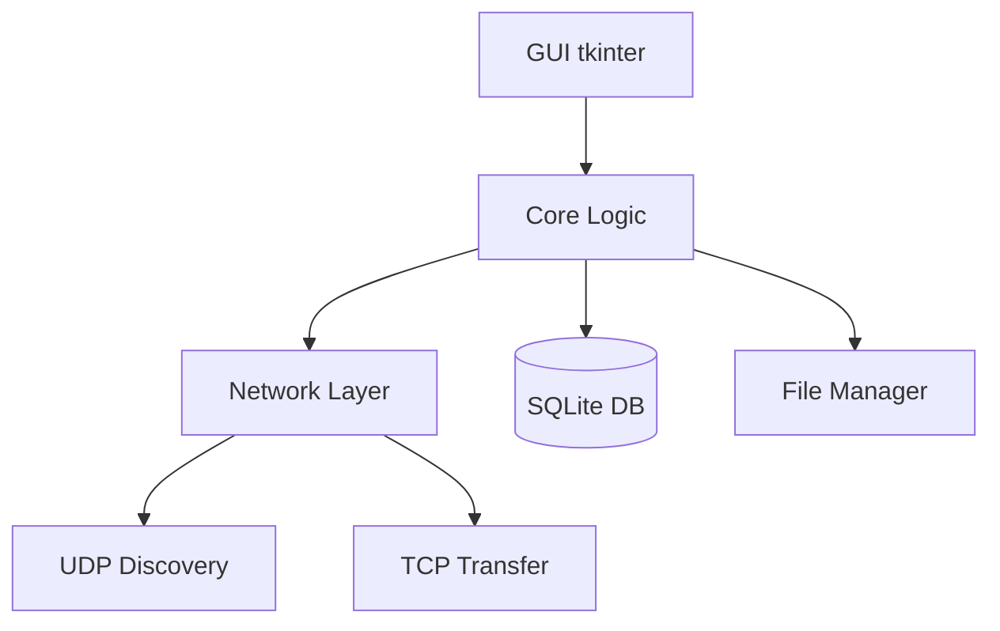

# ✅ CHECKLIST.md - Vérification Finale

**Liste de vérification avant livraison du projet**

Utilisez cette checklist le dernier jour pour vous assurer que tout est prêt.

---

## 📋 Organisation de la Checklist

### 🎯 Sections

1. [Code Quality](#1-code-quality) - Qualité du code
2. [Fonctionnalités](#2-fonctionnalités) - Features requises
3. [Tests](#3-tests) - Validation du système
4. [Documentation](#4-documentation) - Documents requis
5. [Packaging](#5-packaging) - Distribution
6. [Git & Repository](#6-git--repository) - Propreté du repo
7. [Démonstration](#7-démonstration) - Préparation présentation

---

## 1. 💎 Code Quality

### Structure du Code

- [ ] **Architecture respectée**
  - [ ] Dossier `network/` avec discovery, server, client
  - [ ] Dossier `core/` avec file_manager, database, peer_manager
  - [ ] Dossier `gui/` avec main_window, widgets
  - [ ] Dossier `utils/` avec config, logger, protocol
  - [ ] `main.py` à la racine du package

- [ ] **Imports organisés**
  - [ ] stdlib en premier
  - [ ] modules locaux ensuite
  - [ ] Pas d'imports circulaires
  - [ ] Pas d'imports inutilisés

- [ ] **Naming conventions**
  - [ ] Classes en `PascalCase` (`FileManager`)
  - [ ] Fonctions/variables en `snake_case` (`chunk_file`)
  - [ ] Constantes en `UPPER_CASE` (`CHUNK_SIZE`)
  - [ ] Noms descriptifs et clairs

### Documentation du Code

- [ ] **Docstrings présentes**
  - [ ] Toutes les classes ont docstring
  - [ ] Toutes les fonctions publiques ont docstring
  - [ ] Format cohérent (Google/NumPy style)
  
**Exemple à vérifier:**
```python
def chunk_file(self, filepath: str, chunk_size: int = CHUNK_SIZE) -> List[Dict]:
    """
    Découpe un fichier en chunks avec hash SHA256.
    
    Args:
        filepath: Chemin du fichier à découper
        chunk_size: Taille des chunks en bytes (défaut: 256KB)
    
    Returns:
        Liste de dicts {'chunk_index', 'data', 'hash'}
    
    Raises:
        FileNotFoundError: Si fichier n'existe pas
    """
```

- [ ] **Commentaires pertinents**
  - [ ] Logique complexe commentée
  - [ ] Pas de code commenté inutile
  - [ ] TODOs résolus ou documentés

### Gestion d'Erreurs

- [ ] **Try/except présents**
  - [ ] Connexions réseau wrappées
  - [ ] Opérations fichiers protégées
  - [ ] Parsing JSON sécurisé
  - [ ] Pas de `except: pass` sans log

**Exemple:**
```python
try:
    with open(filepath, 'rb') as f:
        data = f.read()
except FileNotFoundError:
    logger.error(f"File not found: {filepath}")
    raise
except Exception as e:
    logger.error(f"Error reading file: {e}", exc_info=True)
    return None
```

- [ ] **Messages d'erreur clairs**
  - [ ] Logs avec niveau approprié (DEBUG/INFO/WARNING/ERROR)
  - [ ] Contexte suffisant dans logs
  - [ ] `exc_info=True` pour stacktraces

### Logging

- [ ] **Pas de print()**
  - [ ] Remplacés par `logger.debug/info/warning/error`
  - [ ] Sauf dans `main.py` pour messages utilisateur

- [ ] **Niveaux appropriés**
  - [ ] DEBUG: détails techniques
  - [ ] INFO: événements importants
  - [ ] WARNING: problèmes récupérables
  - [ ] ERROR: erreurs graves

### Cross-Platform

- [ ] **Chemins portables**
  - [ ] `pathlib.Path` utilisé partout
  - [ ] Pas de `\` ou `/` hardcodés
  - [ ] `Path.home()` pour dossiers utilisateur

**Exemple:**
```python
from pathlib import Path

data_dir = Path(__file__).parent.parent / "data"
db_path = data_dir / "p2p.db"
```

- [ ] **Scripts shell**
  - [ ] `.bat` pour Windows
  - [ ] `.sh` pour Linux
  - [ ] Tous testés

---

## 2. ⚙️ Fonctionnalités

### Découverte Peers (Jour 1-2)

- [ ] **UDP Discovery fonctionne**
  - [ ] Broadcast UDP sur port 5000
  - [ ] Écoute de messages ANNOUNCE
  - [ ] Timeout < 15 secondes pour découvrir peers
  - [ ] Threading non-bloquant

**Test:**
```powershell
# Terminal 1
python main.py

# Terminal 2
python main.py

# Vérifier: 2 peers se voient dans GUI en ~10 sec
```

- [ ] **Peers ajoutés en base**
  - [ ] Table `peers` avec IP, port, last_seen
  - [ ] GUI affiche liste peers
  - [ ] Rafraîchissement auto

### Partage de Fichiers (Jour 2-3)

- [ ] **Chunking fonctionne**
  - [ ] Fichier découpé en 256KB chunks
  - [ ] Hash SHA256 par chunk
  - [ ] Hash global du fichier
  - [ ] Stocké en database

**Test:**
```powershell
# Test 1MB fichier
python -c "
from p2p_file_sharing.core.file_manager import FileManager
fm = FileManager()
chunks = fm.chunk_file('test_1mb.bin')
print(f'Chunks: {len(chunks)}')  # Devrait être ~4
"
```

- [ ] **Database complète**
  - [ ] Table `peers`
  - [ ] Table `files`
  - [ ] Table `chunks`
  - [ ] Table `local_shared_files`
  - [ ] Relations correctes

- [ ] **Broadcast file list**
  - [ ] Partage fichier → broadcast à tous peers
  - [ ] Autres peers reçoivent et stockent en DB
  - [ ] GUI des autres affiche nouveau fichier

**Test:**
```
Peer A: Partager image.jpg
Attendre 3 secondes
Peer B: Devrait voir image.jpg dans liste
```

### Téléchargement (Jour 5-6) ⭐

- [ ] **Download mono-peer fonctionne**
  - [ ] Sélectionner fichier dans GUI
  - [ ] Barre de progression active
  - [ ] Fichier téléchargé complet
  - [ ] Hash vérifié après download

**Test critique:**
```
1. Peer A: Partager fichier test.pdf (5MB)
2. Peer B: Télécharger test.pdf
3. Vérifier taille identique
4. Vérifier hash identique
5. Ouvrir fichier → doit fonctionner
```

- [ ] **(Bonus) Download multi-peer**
  - [ ] Chunks téléchargés depuis plusieurs sources
  - [ ] Assemblage correct
  - [ ] Plus rapide que mono-peer

### Protocole Réseau (Jour 2-3)

- [ ] **TCP Server**
  - [ ] Écoute sur port 5001+
  - [ ] Accept connexions multiples
  - [ ] Threading par client
  - [ ] Messages JSON

- [ ] **Messages implémentés**
  - [ ] `ANNOUNCE` (UDP)
  - [ ] `FILE_LIST_REQUEST`
  - [ ] `FILE_LIST_RESPONSE`
  - [ ] `CHUNK_REQUEST`
  - [ ] `CHUNK_DATA`

- [ ] **Protocole respecté**
  - [ ] Format: `[taille 8 bytes][JSON]`
  - [ ] UTF-8 encoding
  - [ ] Gestion timeout
  - [ ] Fermeture connexions propre

### GUI (Jour 1-3)

- [ ] **Interface complète**
  - [ ] Liste peers (IP, port, statut)
  - [ ] Liste fichiers (nom, taille, owner)
  - [ ] Bouton "Partager fichier"
  - [ ] Bouton "Télécharger"
  - [ ] Barre de progression
  - [ ] Status bar

- [ ] **GUI responsive**
  - [ ] Pas de freeze pendant download
  - [ ] Threads pour opérations longues
  - [ ] Updates via `root.after()`
  - [ ] Fermeture propre (cleanup threads)

---

## 3. 🧪 Tests

### Tests Unitaires

- [ ] **Network tests**
  - [ ] `test_discovery.py` - UDP broadcast/listen
  - [ ] `test_tcp.py` - Server/client connexion
  - [ ] `test_protocol.py` - Sérialisation messages

- [ ] **Core tests**
  - [ ] `test_chunking.py` - Chunking 1MB fichier
  - [ ] `test_database.py` - CRUD operations
  - [ ] `test_peer_manager.py` - Gestion peers

- [ ] **Integration tests**
  - [ ] `test_share_file.py` - Partage end-to-end
  - [ ] `test_download.py` - Download end-to-end

**Lancer les tests:**
```powershell
# Tous les tests
python -m pytest tests/ -v

# Avec coverage
python -m pytest tests/ --cov=p2p_file_sharing
```

### Tests Manuels

- [ ] **Scénario 1: Découverte**
  1. Lancer 2 instances
  2. Vérifier découverte < 15 sec
  3. Fermer une instance → disparaît de l'autre

- [ ] **Scénario 2: Partage**
  1. Peer A partage fichier
  2. Peer B voit fichier dans liste
  3. Vérifier infos fichier (nom, taille)

- [ ] **Scénario 3: Download**
  1. Peer B télécharge fichier de A
  2. Barre progression active
  3. Fichier téléchargé identique
  4. Hash validé

- [ ] **Scénario 4: Multi-peer**
  1. Lancer 3 instances (A, B, C)
  2. Les 3 se découvrent
  3. A partage fichier
  4. B et C le voient
  5. C télécharge depuis A

- [ ] **Scénario 5: Résilience**
  1. Download en cours
  2. Source se déconnecte
  3. Erreur gérée gracieusement (pas de crash)

### Tests Edge Cases

- [ ] **Fichier 0 byte**
  - [ ] Partage fonctionne
  - [ ] Download fonctionne
  - [ ] Pas d'erreur division par zéro

- [ ] **Fichier énorme (100MB+)**
  - [ ] Chunking fonctionne
  - [ ] Pas de memory overflow
  - [ ] Temps acceptable

- [ ] **Caractères spéciaux**
  - [ ] Nom fichier avec espaces: `mon fichier.pdf`
  - [ ] Accents: `fichier_été_2024.doc`
  - [ ] Unicode: `文档.txt`

- [ ] **Réseau instable**
  - [ ] Timeout géré
  - [ ] Retry ou message clair
  - [ ] Pas de deadlock

---

## 4. 📚 Documentation

### Documents Utilisateur

- [ ] **README.md (utilisateur)**
  - [ ] Description projet
  - [ ] Fonctionnalités listées
  - [ ] Prérequis (Python 3.9+)
  - [ ] Instructions installation
  - [ ] Instructions utilisation
  - [ ] Section dépannage
  - [ ] Limitations connues
  - [ ] Contact/support

**Vérifier que README utilisateur inclut:**
```markdown
# Installation
1. Extraire archive
2. Double-clic install.bat
3. ...

# Dépannage
## Peers ne se voient pas
- Cause: Firewall
- Solution: Autoriser Python dans firewall
```

### Documents Développeur

- [ ] **README_PROJET.md**
  - [ ] Vue d'ensemble projet
  - [ ] Architecture technique
  - [ ] Organisation équipe
  - [ ] Timeline 10 jours
  - [ ] Liens vers autres docs

- [ ] **SETUP.md**
  - [ ] Setup GitHub
  - [ ] Config VS Code
  - [ ] Structure dossiers
  - [ ] Environnement Python

- [ ] **CONTRATS_INTERFACES.md**
  - [ ] Interfaces communes
  - [ ] config.py, logger.py, protocol.py
  - [ ] Stubs classes principales

- [ ] **TACHES_PERSONNE{1,2,3}.md**
  - [ ] Tâches détaillées par personne
  - [ ] Code exemples complets
  - [ ] Tests à implémenter

- [ ] **INTEGRATION.md**
  - [ ] Workflow jours 4-9
  - [ ] Procédures merge
  - [ ] Tests intégration

- [ ] **PACKAGING.md**
  - [ ] Scripts installation
  - [ ] Scripts lancement
  - [ ] Création archive

- [ ] **GIT_COMMANDS.md**
  - [ ] Commandes Git essentielles
  - [ ] Workflow quotidien
  - [ ] Résolution conflits

- [ ] **CHECKLIST.md** (ce fichier)
  - [ ] Vérification finale complète

### Commentaires Code

- [ ] **Fichiers avec header**
  - [ ] Docstring module en haut
  - [ ] Description du module
  - [ ] Auteur/date (optionnel)

**Exemple:**
```python
"""
Module de découverte UDP pour peers P2P.

Permet le broadcast et l'écoute de messages ANNOUNCE
pour découvrir automatiquement les peers sur le réseau local.
"""
```

---

## 5. 📦 Packaging

### Scripts Installation

- [ ] **install.bat (Windows)**
  - [ ] Vérifie Python installé
  - [ ] Vérifie version Python >= 3.9
  - [ ] Installe dépendances (si requirements.txt)
  - [ ] Crée dossiers (data, shared_files)
  - [ ] Messages clairs

**Tester:**
```powershell
# Sur machine Windows propre
.\install.bat

# Devrait:
# - [OK] Python détecté
# - [OK] Version compatible
# - [OK] Dossiers créés
```

- [ ] **install.sh (Linux)**
  - [ ] Vérifie python3
  - [ ] Vérifie version
  - [ ] Vérifie tkinter
  - [ ] Crée dossiers
  - [ ] Rend run.sh exécutable

**Tester:**
```bash
chmod +x install.sh
./install.sh

# Devrait réussir sans erreur
```

### Scripts Lancement

- [ ] **run.bat (Windows)**
  - [ ] Utilise `pythonw` (pas de console)
  - [ ] Fallback sur `python` si pythonw absent
  - [ ] Démarre l'app

- [ ] **run.sh (Linux)**
  - [ ] Lance avec `python3`
  - [ ] Exécutable (`chmod +x`)

- [ ] **(Bonus) run_debug.bat**
  - [ ] Lance avec console visible
  - [ ] Pour voir logs en temps réel

### Archive Distribution

- [ ] **Contenu archive**
  - [ ] Code source `p2p_file_sharing/`
  - [ ] Scripts: install.{bat,sh}, run.{bat,sh}
  - [ ] README.md utilisateur
  - [ ] requirements.txt (si nécessaire)
  - [ ] PAS de `data/`, `__pycache__`, `.git/`

**Créer archive:**
```powershell
# Windows
Compress-Archive -Path p2p_file_sharing, install.bat, install.sh, run.bat, run.sh, README.md -DestinationPath p2p_file_sharing_v1.0.zip

# Linux
tar -czf p2p_file_sharing_v1.0.tar.gz p2p_file_sharing/ install.bat install.sh run.bat run.sh README.md
```

- [ ] **Archive testée**
  - [ ] Extraire sur machine vierge
  - [ ] Install fonctionne
  - [ ] Run fonctionne
  - [ ] Taille < 500KB

---

## 6. 🔀 Git & Repository

### Propreté Repository

- [ ] **Branches mergées**
  - [ ] `feature/network` mergée dans `main`
  - [ ] `feature/core` mergée dans `main`
  - [ ] `feature/gui` mergée dans `main`
  - [ ] Tout le monde sur `main` à jour

**Vérifier:**
```powershell
git checkout main
git pull origin main
git log --oneline -10  # Voir historique
```

- [ ] **Pas de fichiers sensibles**
  - [ ] Pas de `.db` committés
  - [ ] Pas de `.log` committés
  - [ ] Pas de credentials
  - [ ] Pas de fichiers persos

- [ ] **.gitignore complet**
  ```
  __pycache__/
  *.pyc
  *.pyo
  *.db
  *.log
  data/
  shared_files/
  downloads/
  .vscode/
  .idea/
  *.egg-info/
  dist/
  build/
  ```

- [ ] **README.md à jour**
  - [ ] Section installation correcte
  - [ ] Badges (optionnel): Python version, license
  - [ ] Screenshots (optionnel)

### Commits Propres

- [ ] **Messages clairs**
  - [ ] Format: `type: description`
  - [ ] Pas de "wip", "fix", "update" seuls
  - [ ] Commits logiques (pas 1 commit de 500 lignes)

- [ ] **Historique linéaire**
  - [ ] Pas de merge commits inutiles
  - [ ] Timeline claire

**Vérifier log:**
```powershell
git log --oneline --graph --all

# Devrait ressembler à:
# * abc123 (HEAD -> main) feat: Add multi-peer download
# * def456 feat: Implement file download
# * ghi789 feat: Add file sharing with broadcast
# ...
```

### Tags & Releases

- [ ] **Tag version finale**
  ```powershell
  git tag -a v1.0 -m "Version 1.0 - Initial release"
  git push origin v1.0
  ```

- [ ] **(Bonus) GitHub Release**
  - [ ] Aller sur GitHub → Releases → New Release
  - [ ] Attacher archive .zip
  - [ ] Description features
  - [ ] Notes version

---

## 7. 🎤 Démonstration

### Préparation Demo

- [ ] **Fichiers de test prêts**
  - [ ] Petit fichier: 1MB (rapide)
  - [ ] Moyen fichier: 10MB
  - [ ] (Optionnel) Gros fichier: 50MB

**Créer fichiers test:**
```powershell
# Windows
fsutil file createnew test_1mb.bin 1048576
fsutil file createnew test_10mb.bin 10485760

# Linux
dd if=/dev/urandom of=test_1mb.bin bs=1M count=1
dd if=/dev/urandom of=test_10mb.bin bs=1M count=10
```

- [ ] **Scénario demo écrit**
  ```markdown
  # Demo Script (5 minutes)
  
  1. [30s] Lancer 2 instances P2P
  2. [30s] Montrer découverte automatique
  3. [1min] Peer A partage fichier test_10mb.bin
  4. [30s] Peer B voit fichier dans liste
  5. [2min] Peer B télécharge fichier
  6. [30s] Vérifier hash identique
  7. [30s] Questions
  ```

- [ ] **Machines de demo configurées**
  - [ ] 2 machines (ou 2 VMs)
  - [ ] Même réseau
  - [ ] Firewall configuré
  - [ ] App installée et testée

### Présentation Technique

- [ ] **Slides préparées** (10-15 slides)
  1. Titre + équipe
  2. Problématique
  3. Architecture globale
  4. Module Network (Personne 1)
  5. Module Core (Personne 2)
  6. Module GUI (Personne 3)
  7. Protocole réseau
  8. Défis rencontrés
  9. Solutions apportées
  10. Demo live
  11. Statistiques (lignes code, commits)
  12. Améliorations futures
  13. Questions

- [ ] **Diagramme architecture**
  - [ ] Schéma modules
  - [ ] Flux de données
  - [ ] Protocole réseau

**Exemple Mermaid:**


- [ ] **Statistiques projet**
  ```powershell
  # Lignes de code
  Get-ChildItem -Recurse -Include *.py | Measure-Object -Property Length -Sum
  
  # Nombre commits
  git rev-list --count main
  
  # Contributeurs
  git shortlog -sn
  ```

### Questions Anticipées

- [ ] **"Fonctionne sur Internet ?"**
  - Réponse: Non, seulement réseau local (UDP broadcast limité)
  - Amélioration: Ajouter serveur discovery centralisé

- [ ] **"Données chiffrées ?"**
  - Réponse: Non, pas de chiffrement actuellement
  - Amélioration: Ajouter TLS/SSL

- [ ] **"Gestion plusieurs téléchargements simultanés ?"**
  - Réponse: Oui via threading
  - Limite: Dépend bande passante

- [ ] **"Taille max fichier ?"**
  - Réponse: Théoriquement illimité (chunking)
  - Pratique: Testé jusqu'à 100MB

- [ ] **"Reprise download interrompu ?"**
  - Réponse: Non dans v1.0
  - Amélioration: Tracker chunks reçus en DB

---

## 📊 Métriques Attendues

### Code

- **Lignes de code:** ~1500-2500 lignes
- **Fichiers Python:** ~15-20 fichiers
- **Tests:** ~5-10 fichiers tests
- **Coverage:** > 60% (bonus si > 80%)

### Git

- **Commits:** 30-50 commits
- **Branches:** 3-4 branches
- **Collaborateurs:** 3 personnes
- **Tags:** 1-2 tags (v1.0)

### Performance

- **Discovery:** < 15 secondes
- **Share file:** < 5 secondes
- **Download 10MB:** < 30 secondes (réseau local)
- **GUI Startup:** < 2 secondes

---

## ✅ Validation Finale

### Checklist Rapide

**Code:**
- [ ] Compile sans erreurs
- [ ] Pas de warnings critiques
- [ ] Docstrings présentes
- [ ] Logging au lieu de print

**Fonctionnel:**
- [ ] Discovery fonctionne
- [ ] Partage fonctionne
- [ ] Download fonctionne
- [ ] GUI responsive

**Documentation:**
- [ ] README clair
- [ ] Installation documentée
- [ ] Dépannage inclus

**Packaging:**
- [ ] install.bat/sh fonctionnent
- [ ] run.bat/sh fonctionnent
- [ ] Archive créée et testée

**Git:**
- [ ] Tout pushé
- [ ] Branches mergées
- [ ] Pas de fichiers sensibles

**Demo:**
- [ ] Scénario écrit
- [ ] Machines prêtes
- [ ] Slides préparées

---

## 🎯 Critères d'Acceptation Minimum

**Pour valider le projet, vous DEVEZ avoir:**

1. ✅ **Découverte peers fonctionne** (2+ instances se voient)
2. ✅ **Partage fichier fonctionne** (visible sur autres peers)
3. ✅ **Download fonctionne** (fichier téléchargé identique)
4. ✅ **GUI complète** (liste peers, fichiers, boutons)
5. ✅ **Hash vérifié** (intégrité garantie)
6. ✅ **Documentation** (README + guides)
7. ✅ **Installable** (scripts install fonctionnent)
8. ✅ **Demo réussie** (scénario end-to-end)

**Nice to have (bonus):**
- Multi-peer download
- Tests unitaires > 80% coverage
- Logs détaillés
- Gestion erreurs exhaustive
- UI polie

---

## 🚀 Go/No-Go Decision

### GO (Prêt à livrer) si:

- [x] Tous les critères minimum validés
- [x] Tests principaux passent
- [x] Demo fonctionne sur 2 machines
- [x] Documentation complète
- [x] Archive créée et testée

### NO-GO (Pas encore prêt) si:

- [ ] Discovery ne fonctionne pas
- [ ] Download échoue ou corrompt fichiers
- [ ] Crashes fréquents
- [ ] Pas de documentation
- [ ] Code pas sur GitHub

---

## 📞 Derniers Ajustements (J-1)

### Priorités si retard

**HIGH PRIORITY (MUST):**
1. Discovery fonctionne
2. Download fonctionne (mono-peer)
3. README utilisateur
4. Scripts install

**MEDIUM PRIORITY (SHOULD):**
5. Tests unitaires
6. Logs propres
7. GUI polie
8. Gestion erreurs

**LOW PRIORITY (NICE TO HAVE):**
9. Multi-peer download
10. Features avancées
11. Optimisations

### Si vraiment en retard

**Simplifiez si nécessaire:**
- Skip multi-peer download
- Minimum de tests (juste smoke tests)
- GUI basique suffit
- 1-2 docs essentiels

**MAIS gardez:**
- Discovery
- Share
- Download mono-peer
- Hash verification
- README

---

## 🎉 Félicitations !

Si vous avez coché toutes les cases ✅, votre projet est **prêt pour livraison** ! 🚀

**Conseils dernière minute:**
- Dormez bien la veille de la démo
- Testez 1 dernière fois le matin
- Arrivez en avance
- Ayez plan B si démo échoue (vidéo backup)
- Célébrez votre réussite ! 🎊

---

**Bon courage pour la présentation ! 💪**
